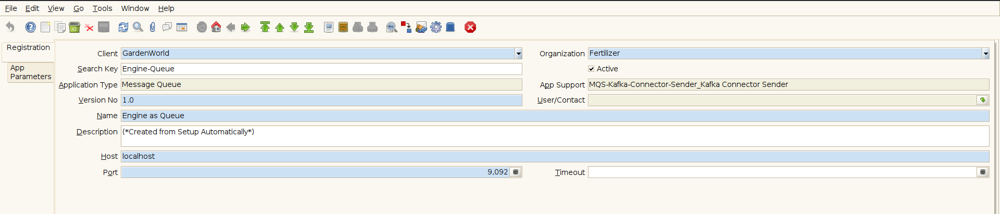
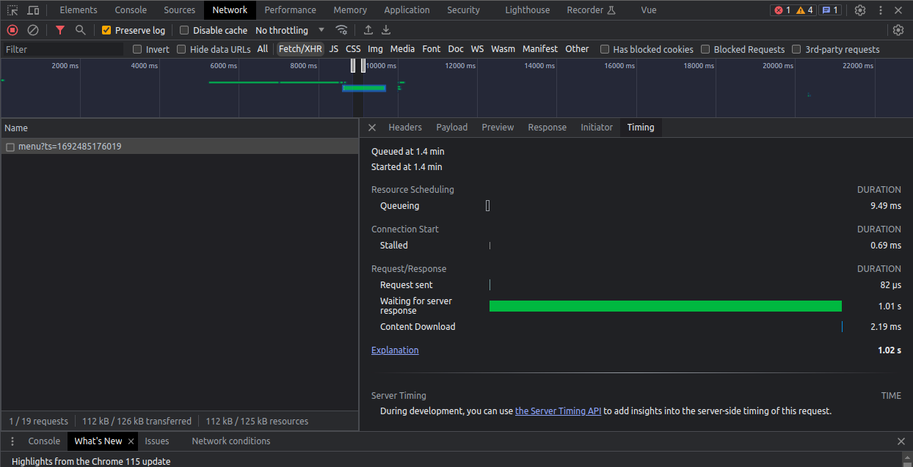
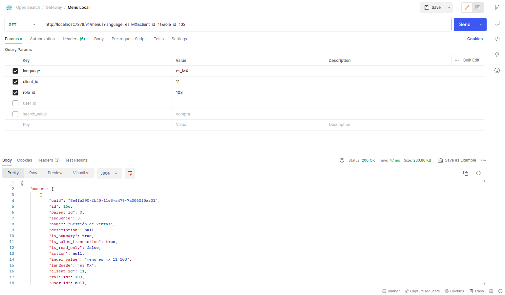

# ADempiere Kafka Connector

A Queue manager for send records from ADempiere to queue, this implementation was created with [kafka](https://kafka.apache.org/) queue.
The scope for this is a little test using a external queue for process documents and also is just a project used for learn about micro-services and a hobby of saturday :)

## Requirements
- [JDK 11 or later](https://adoptium.net/)
- [Gradle 8.0.1 or later](https://gradle.org/install/)


## Running It (Easy way)

This project is directly related to [OpenSearch-Gateway-rs](https://github.com/adempiere/opensearch_gateway_rs#run-docker-compose-easy-way). I you want to test it then is nice if you can deploy the  project [OpenSearch-Gateway-rs](https://github.com/adempiere/opensearch_gateway_rs#run-docker-compose-easy-way).

A simple config for queue can be this:



The runnning is:


### Compare Services

A simple request for adempiere menu using [adempiere-grpc-server](https://github.com/solop-develop/adempiere-grpc-server) take almost **1.02 seconds**.



A request using the [OpenSearch-Gateway-rs](https://github.com/adempiere/opensearch_gateway_rs) take almost **47 ms**.



The main reason is that [OpenSearch](https://opensearch.org/) is a special service for queries. You can learn anout it in the [official page](https://opensearch.org/docs/latest/#why-use-opensearch)

## Project Definition

### Packages Names
All packages was sign with entity type code `eca56`, note that this way is more clear and simple for look at

```Java
org.spin.eca56.model.validator
org.spin.eca56.setup
org.spin.eca56.util
org.spin.eca56.util.queue
org.spin.eca56.util.support
org.spin.eca56.util.support.documents
org.spin.eca56.util.support.kafka
```

### Model Validators
The main validator is located at `org.spin.eca56.model.validator.EngineAsQueue`, this read all tables flagged as document and add these tables to trigger:

- `TIMING_AFTER_COMPLETE`
- `TIMING_AFTER_REVERSECORRECT`
- `TIMING_AFTER_REVERSEACCRUAL`
- `TIMING_AFTER_VOID`

### Model Deploy class
This project has two deploy class for all functionality:

- `org.spin.eca56.setup.CreateConfig`: Create a App registration for connect with kafka server with the follow data:
  - Value: `Engine-Queue`
  - Name: `Engine as Queue`
  - Host: `localhost`
  - Port: `29092`
- `org.spin.eca56.setup.DeployValidator`: Create the model validator config linked to current client

## Binary Project

You can get all binaries from github [here](https://central.sonatype.com/artifact/io.github.adempiere/adempiere-kafka-connector/1.0.0).

All contruction is from github actions


## Some XML's:

All dictionary changes are writing from XML and all XML's hare `xml/migration`


## How to add this library?

Is very easy.

- Gradle

```Java
implementation 'io.github.adempiere:adempiere-kafka-connector:1.0.0'
```

- SBT

```
libraryDependencies += "io.github.adempiere" % "adempiere-kafka-connector" % "1.0.0"
```

- Apache Maven

```
<dependency>
    <groupId>io.github.adempiere</groupId>
    <artifactId>adempiere-kafka-connector</artifactId>
    <version>1.0.0</version>
</dependency>
```